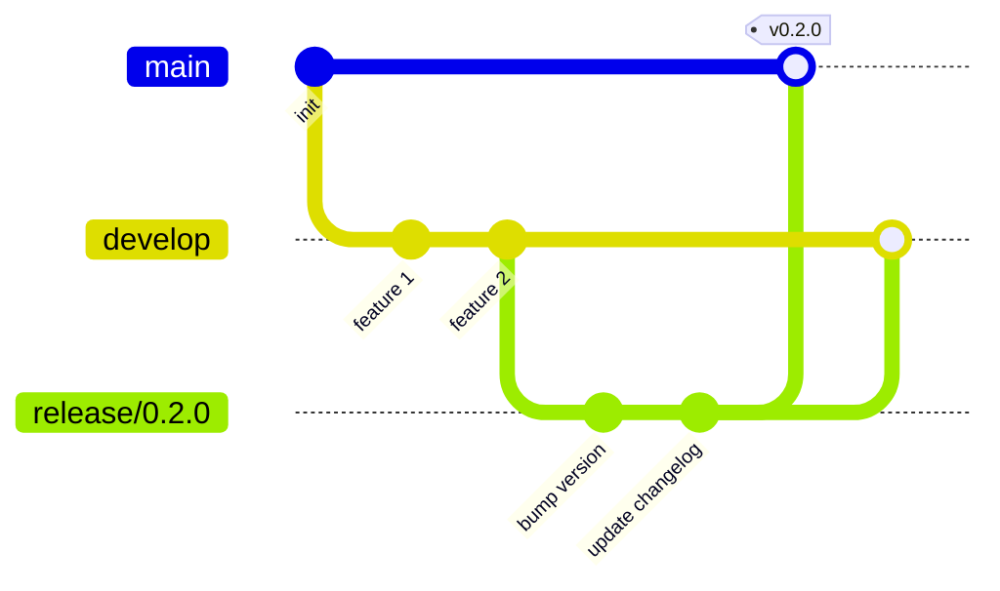

# 发版规范

本文档定义了 QData Expression 项目的版本管理和发布流程规范。

## 📌 版本号规范

本项目遵循 [语义化版本 2.0.0](https://semver.org/lang/zh-CN/) 规范：

```
主版本号.次版本号.修订号 (MAJOR.MINOR.PATCH)
```

### 版本号递增规则

- **主版本号 (MAJOR)**：不兼容的 API 修改
- **次版本号 (MINOR)**：向下兼容的功能性新增
- **修订号 (PATCH)**：向下兼容的问题修正

### 示例

- `0.1.0` → `0.1.1`：修复 bug
- `0.1.1` → `0.2.0`：新增功能
- `0.2.0` → `1.0.0`：重大更新或 API 不兼容变更

## 🌳 分支策略

### 主要分支

```
main (主分支)
├── develop (开发分支)
├── release/x.y.z (发布分支)
└── hotfix/x.y.z (热修复分支)
```

| 分支 | 用途 | 保护级别 |
|------|------|----------|
| `main` | 生产环境代码，每个提交对应一个发布版本 | 🔒 保护 |
| `develop` | 开发主线，包含最新的开发功能 | 🔒 保护 |
| `feature/*` | 功能开发分支 | 开放 |
| `release/*` | 发布准备分支 | 半保护 |
| `hotfix/*` | 紧急修复分支 | 半保护 |

### 分支工作流



## 🏷️ Tag 规范

### Tag 命名格式

```bash
# 正式版本
v<major>.<minor>.<patch>
例如: v0.1.0, v1.0.0, v2.3.5

# 预发布版本 (Release Candidate)
v<major>.<minor>.<patch>-rc<number>
例如: v0.1.0-rc1, v1.0.0-rc2

# 测试版本
v<major>.<minor>.<patch>-beta<number>
例如: v0.1.0-beta1

# Alpha 版本
v<major>.<minor>.<patch>-alpha<number>
例如: v0.1.0-alpha1
```

### Tag 类型与发布目标

| Tag 格式 | 触发流程 | 发布目标 |
|----------|----------|----------|
| `v*.*.*` | `publish.yml` | PyPI 正式环境 |
| `v*.*.*-rc*` | `publish-test.yml` | Test PyPI |
| `v*.*.*-beta*` | `publish-test.yml` | Test PyPI |
| `v*.*.*-alpha*` | - | 不自动发布 |

## 📋 发布流程

### 1️⃣ 正式版本发布

```bash
# 1. 从 develop 创建 release 分支
git checkout develop
git pull origin develop
git checkout -b release/0.2.0

# 2. 更新版本号
# 编辑 src/qdata_expr/_version.py
# 编辑 pyproject.toml

# 3. 更新 CHANGELOG.md
# 添加本次版本的更新内容

# 4. 提交版本更新
git add .
git commit -m "chore: bump version to 0.2.0"

# 5. 合并到 main 并打 tag
git checkout main
git merge --no-ff release/0.2.0 -m "Release v0.2.0"
git tag -a v0.2.0 -m "Release version 0.2.0"

# 6. 合并回 develop
git checkout develop
git merge --no-ff release/0.2.0

# 7. 推送到远程
git push origin main
git push origin develop
git push origin v0.2.0

# 8. 在 GitHub 创建 Release
# 访问: https://github.com/qeasy/qdata-expression/releases/new
# 选择 tag: v0.2.0
# 填写 Release Notes (从 CHANGELOG.md 复制)
# 点击 "Publish release"
```

### 2️⃣ RC (Release Candidate) 版本发布

用于正式发布前的测试验证：

```bash
# 1. 创建 RC tag
git checkout develop
git tag -a v0.2.0-rc1 -m "Release Candidate 1 for v0.2.0"
git push origin v0.2.0-rc1

# 2. 自动触发 publish-test.yml
# 发布到 Test PyPI: https://test.pypi.org/

# 3. 测试安装
pip install -i https://test.pypi.org/simple/ qdata-expression==0.2.0rc1

# 4. 验证通过后，按照正式版本流程发布
```

### 3️⃣ Hotfix 紧急修复

```bash
# 1. 从 main 创建 hotfix 分支
git checkout main
git checkout -b hotfix/0.1.1

# 2. 修复问题并更新版本号
# 修复代码...
# 更新版本号到 0.1.1

# 3. 提交修复
git add .
git commit -m "fix: critical bug in X component"
git commit -m "chore: bump version to 0.1.1"

# 4. 合并到 main 并打 tag
git checkout main
git merge --no-ff hotfix/0.1.1
git tag -a v0.1.1 -m "Hotfix version 0.1.1"

# 5. 合并回 develop
git checkout develop
git merge --no-ff hotfix/0.1.1

# 6. 推送并创建 Release
git push origin main develop
git push origin v0.1.1
```

## 🔄 自动化流程

### CI/CD 流水线

```yaml
触发条件:
  - Push to main/develop → CI 测试
  - Pull Request → CI 测试 + Lint
  - Tag v*.*.* → CI + Build + 发布到 PyPI
  - Tag v*.*.*-rc* → CI + Build + 发布到 Test PyPI
  - Release Published → 发布到 PyPI
```

### GitHub Actions 工作流

| 工作流 | 触发条件 | 作用 |
|--------|----------|------|
| `ci.yml` | push, PR | 运行测试、代码检查 |
| `publish.yml` | Release published | 发布到 PyPI |
| `publish-test.yml` | Tag `v*-rc*` | 发布到 Test PyPI |

## ✅ 发布前检查清单

在执行发布前，请确认：

- [ ] 所有 CI 测试通过
- [ ] 代码已经过 Code Review
- [ ] 版本号已更新 (`_version.py`, `pyproject.toml`)
- [ ] `CHANGELOG.md` 已更新
- [ ] 文档已同步更新
- [ ] 示例代码可正常运行
- [ ] 没有遗留的 TODO 或 FIXME
- [ ] PyPI API Token 已配置 (首次发布)

## 🔐 PyPI 配置

### 1. Trusted Publishing (推荐)

在 PyPI 项目设置中配置 Trusted Publishers：

```
Publisher: GitHub
Owner: qeasy
Repository: qdata-expression
Workflow: publish.yml
Environment: pypi
```

### 2. API Token 方式 (备选)

在 GitHub 仓库设置 Secrets：

```
Settings → Secrets and variables → Actions → New repository secret

名称: PYPI_API_TOKEN
值: pypi-xxx... (你的 PyPI API Token)

名称: TEST_PYPI_API_TOKEN
值: pypi-xxx... (你的 Test PyPI API Token)
```

## 📝 CHANGELOG 维护

每次发版必须更新 `CHANGELOG.md`：

```markdown
## [0.2.0] - 2026-01-22

### Added
- 新功能 A
- 新功能 B

### Changed
- 改进 X
- 优化 Y

### Fixed
- 修复 bug #123
- 修复 bug #456

### Deprecated
- 废弃 API Z

### Removed
- 移除旧功能 W

### Security
- 修复安全问题 #789
```

## 🚀 快速命令参考

```bash
# 查看当前版本
python -c "from qdata_expr import __version__; print(__version__)"

# 构建包
python -m build

# 检查包
twine check dist/*

# 上传到 Test PyPI
twine upload --repository testpypi dist/*

# 上传到 PyPI
twine upload dist/*

# 创建并推送 tag
git tag -a v0.2.0 -m "Release v0.2.0"
git push origin v0.2.0

# 查看所有 tags
git tag -l

# 删除 tag (本地和远程)
git tag -d v0.2.0
git push origin :refs/tags/v0.2.0
```

## 📚 参考资料

- [Semantic Versioning 2.0.0](https://semver.org/)
- [Git Flow Workflow](https://nvie.com/posts/a-successful-git-branching-model/)
- [Python Packaging User Guide](https://packaging.python.org/)
- [PyPI Publishing with GitHub Actions](https://packaging.python.org/en/latest/guides/publishing-package-distribution-releases-using-github-actions-ci-cd-workflows/)
